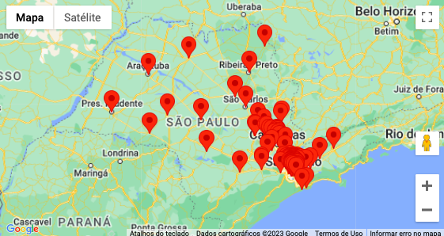
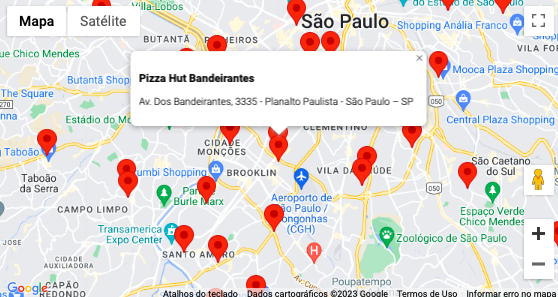
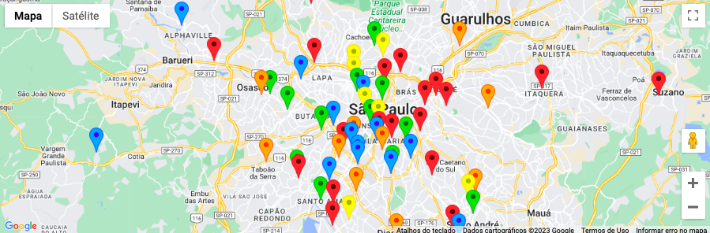
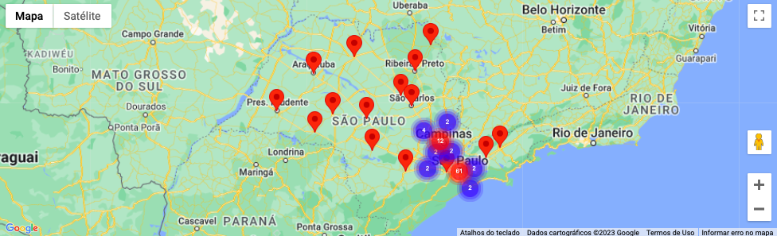

# google-maps-api

## 🚀 Projeto
Visualize dados geográficos em gráficos de mapas, encontre relações de modo mais fácil, e tenha insights melhores!</br>

Exemplo: Uma rede de franquias de restaurantes [Pizza Hut](https://pizzahut.com.br) 🍕. Com uma lista de [todas as unidades](https://promo.pizzahut.com.br/cupons/) (arquivo <code>[places.csv](https://github.com/Alessandro1918/google-maps-api/blob/main/public/places.csv)</code>), podemos avaliar quais bairros estão com o mercado completo, ou quais apresentam oportunidades de expansão. Se o arquivo conter dados de faturamento das unidades, podemos ver quais regiões tem maior poder aquisitivo. Incluindo dados de delivery em tempo real, podemos ver quais regiões apresentam gargalos nos tempos de entrega!

## 🛠️ Tecnologias
- [API de Maps do Google](https://developers.google.com/maps/documentation/javascript?hl=pt-br) 
- [Next.js](https://nextjs.org)

## 📊 Opções de Mapas
- Mapa de Pontos</br>
  Visualize todas as coordenadas de uma lista de lugares em um mesmo mapa.</br>
  Demo: clique no mapa para ver o exemplo funcionando!
  <div align="center">
    <a href="https://google-maps-api-alessandro1918.vercel.app/points-map">
      
    </a>
    <a href="https://google-maps-api-alessandro1918.vercel.app/points-map">
      
    </a>
  </div>

- Marcadores customizados </br>
  Personalize seus marcadores com base em algum critério quantitativo (tempo de entrega, por ex.).</br>
  Demo: clique no mapa para ver o exemplo funcionando!
  <div align="center">
    <a href="https://google-maps-api-alessandro1918.vercel.app/custom-markers">
      
    </a>
  </div>

- Marcadores agrupados </br>
  Muitos marcadores no mapa? Junte-os em um grupo! Clique no grupo ou dê zoom para ver os marcadores individuais.</br>
  Demo: clique no mapa para ver o exemplo funcionando!
  <div align="center">
    <a href="https://google-maps-api-alessandro1918.vercel.app/cluster-markers">
      
    </a>
  </div>

- Outras opções de Mapas: 🚧 Em construção 🚧

## 🗂️ Utilização

### 🐑🐑 Clonando o repositório:

```bash
  $ git clone url-do-projeto.git
```

### 🔑 Configurando a API Google Maps:
- [Crie um projeto na Google Cloud](https://developers.google.com/maps/documentation/javascript/cloud-setup?hl=pt-br)
- [Adicione uma chave de API ao projeto](https://developers.google.com/maps/documentation/javascript/get-api-key?hl=pt-br)
- Adicione a chave de API ao seu arquivo <code>.env</code>, de acordo com o arquivo <code>.env.example</code>

### ▶️ Rodando o App:

```bash
  $ cd google-maps-api
  $ npm install             #download dependencies to node_modules
  $ npm run dev             #start the project
```

## ⭐ Like, Subscribe, Follow!
Curtiu o projeto? Marque esse repositório com uma Estrela ⭐!
